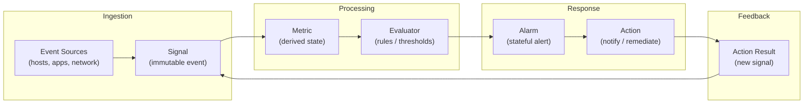

# Sisyphus

A **SIEM**-like event processing and alerting system focused on continuously deriving operational state from immutable signals.

## Glossary

- **Signal** - Immutable and temporally decoupled event from a host, app, or network. Signals are append only and serve as a source of truth.
- **Metric** - A derived property computed from one or more Signals, calculated over defined time windows and persisted for historical analysis.
- **Alarm** - A stateful, actionable condition triggered when user-defined rules over Metrics are violated. Alarms track lifecycle state (e.g. firing, resolved).
- **Action** - A response executed as a result of an Alarm, such as notification or automated remediation, which itself emits a new Signal back into the system.